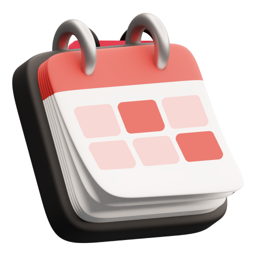
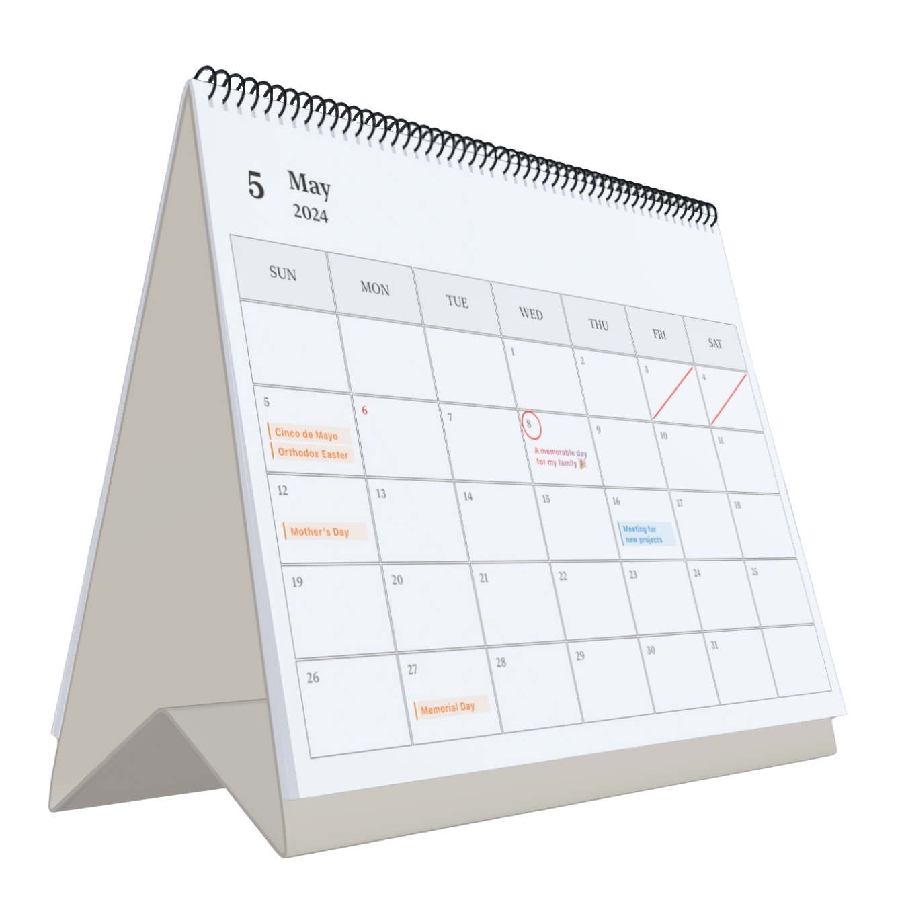

# Spatial Calendar 

**Making Your Calendar Tangible.**
Spatial Calendar is a lightweight calendar app designed for Vision OS.
Immerse yourself in a truly authentic calendar experience that makes your moments feel more real and natural.

## Features

- Event Management and Sync: Sync and edit your schedule via iCloud.
- Journaling: Record your current mood, achievements or anything else anytime.
- Marking: Circle dates for emphasis; or strike through entire days to mark completion.
- DIY Back: Upload your most memorable or beautiful photo for the back of each page of the calendar.
- Lunar Mode: Check the Chinese lunar calendar dates, traditional festivals, solar terms and estimate auspicious and inauspicious events of the day.
